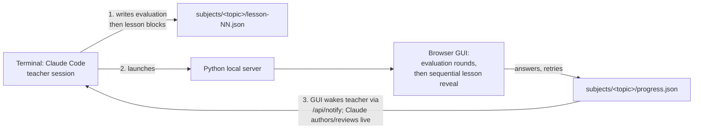

# Kalilmod

## What is Kalilmod

Kalilmod is an interactive teaching tool built around Claude Code. It solves a common problem in modern self-learning: LLMs and the internet provide such good explanations that a student can skim them, feel like they understand, and forget everything shortly after. Real learning happens only when the student must actively solve problems. Kalilmod forces interactive learning by alternating short explanations with frequent small quizzes — the student must engage with the material at every step instead of passively reading.

The creator of the repository is Michael Kali. "Kalilmod" sounds like the Hebrew קל ללמוד, meaning "easy to learn".

## Claude Code's two roles

Claude Code serves two roles in this repository:

1. **Builder** — writes the tool itself (server, GUI viewer, docs) and documents it so future sessions can use it.
2. **Teacher** — in future sessions, authors content and orchestrates the learning process. This has **two modes**, each with its own command and guide but the same infrastructure (GUI, server, block schema, live loop):
   - **Teaching** (`/teach-me` → `docs/teacher-guide.md`): the session evaluates the student and *authors* the lesson content itself.
   - **Guided reading** (`/read-with-me` → `docs/reading-guide.md`): the student supplies an existing source (paper, chapter, web page); the session *does not teach it* — it reads the actual source, then choreographs attention and tests comprehension. For advanced primary texts this avoids the LLM over-digesting or hallucinating the material.

> **Current role: both.** The v1 tool works (server, viewer, sample subjects) and both teacher modes are documented. If the user asks to **learn a subject**, act as Teacher: follow `docs/teacher-guide.md`. If the user asks to **actively read a specific text**, follow `docs/reading-guide.md`. If the user asks to **develop the tool**, act as Builder.

## Architecture (v1)

### Feasibility background

The original idea — an HTML GUI backed by a background Claude session — is fully possible via the **Claude Agent SDK for Python** (`pip install claude-agent-sdk`): programmatic multi-turn sessions, streaming, resuming a session later (`resume=session_id`), and file tools scoped to a directory. It works on Windows. **However**, the Agent SDK requires an `ANTHROPIC_API_KEY` (Anthropic Console account, pay-per-token); it does not use the Claude Code subscription login. To avoid extra billing, **v1 uses the interactive Claude Code terminal session itself as the teacher** (subscription auth, zero marginal cost). The design keeps the lesson-file contract independent of who writes it, so the SDK can be swapped in later without redesign.

### v1 workflow



1. The user runs the one command — **`/teach-me <topic>`** to start a subject, or **`/teach-me`** (no topic) to resume one. It is a thin wrapper (in `.claude/commands/`) around `docs/teacher-guide.md`.
2. For a new subject, Claude writes `lesson-NN.json` with a first round of **`assess`** blocks (diagnostic questions — no terminal interview), then launches the server in **dynamic** mode, which opens the browser and **stays live hands-free** (below).
3. The student answers the evaluation in the GUI; the teacher wakes, reads the answers, and either asks a **finer round** of `assess` questions or authors the lesson blocks (appended after the assessment) — 1–3 rounds before teaching begins.
4. The GUI reveals lesson blocks one at a time; multiple-choice quizzes gate with hints then "show answer". Free-text (`quiz-free`) answers, feedback, and lesson-finished each wake the teacher (below), which writes the review/edit; the GUI polls the read-only `reviews.json` and lesson file and updates **with no refresh or terminal action**. The open lesson lives in the URL hash, so F5 restores position.
5. Finishing a lesson wakes the teacher to author the next one from `progress.json` (hard questions, retries, free-text). Content is generated incrementally, indefinitely — the user runs `/teach-me` only once.

**Session modes.** *Dynamic* (default; `/teach-me` launches it) means a live Claude session is present, enabling free-text review and live lesson edits. *Static* (`python serve.py --static`, for non-Claude LLMs or plain replay) disables those: free-text questions are self-checked against a hidden `reference`. The GUI reads the mode from `/api/mode`.

**File ownership (no write races).** `progress.json` is written only by the GUI (position, quiz state, free-text answers, feedback). `reviews.json` is written only by Claude (free-text verdicts, `feedbackHandled` counter) and served read-only. Lesson files are written by Claude, read by the GUI. Both `progress.json` and `reviews.json` are git-ignored per-user state; lessons are tracked.

### The hands-free loop (built into `/teach-me`, on subscription)

Free-text evaluation works **without an API key** — the live Claude Code session evaluates it. There is no manual terminal round-trip: **`/teach-me` stays live and reacts to the browser itself**, on the Claude subscription. The server has a long-poll `GET /api/wait`; the GUI fires `POST /api/notify` on every action (free-text answer, feedback, lesson finished); the teacher session arms a backgrounded `curl /api/wait` and its **exit re-invokes the session** (the Claude Code harness re-invokes on a backgrounded command exiting), which handles the event and re-arms (idle heartbeat ~30 min via the `timeout`). Event-driven, ≈zero tokens while idle, no API key. Loop state lives only in the server's monotonic `seq` and the subject files, so a **fresh session resumes** by re-running `/teach-me` — only the chat is lost, never progress. The event bus and wiring are in `serve.py`; the loop protocol is in `.claude/commands/teach-me.md`.

### Further upgrade path (Agent SDK, later phase)

The `/teach-me` loop gives the single-window experience but still needs an **open interactive session** kept alive. A background Agent SDK session (`claude-agent-sdk` + `ANTHROPIC_API_KEY`, pay-per-token) would add what the subscription loop can't:

- A true **always-on/background** teacher — no interactive terminal to keep open.
- Resuming a teaching session days later via the SDK's session-resume support, with conversational memory intact (the subscription loop rebuilds context from files instead).

Nothing in the lesson-file format or server needs to change for this upgrade; only the transport of "who generates content and evaluates free text" changes (the file-ownership split and the wait/notify bus already anticipate it).

## Planned repository layout

```
serve.py                     # local server: serves the GUI + JSON API; --static flag; /api/mode
gui/                         # static HTML/JS lesson viewer (one generic viewer for all subjects)
.claude/commands/            # slash-command skills: teach-me (author a lesson) and read-with-me (guide a reading); each launches the server and runs the live loop
subjects/<topic>/            # one folder per subject (both skills write here)
    lesson-01.json           # lesson files, numbered sequentially (tracked in git)
    lesson-02.json
    progress.json            # GUI-owned per-user state: position, answers, feedback, prefs (git-ignored)
    reviews.json             # Claude-owned: free-text verdicts, feedbackHandled (git-ignored)
docs/teacher-guide.md        # content-authoring instructions for /teach-me sessions
docs/reading-guide.md        # guided-reading instructions for /read-with-me sessions
tools/pdf_pages.py           # read a PDF one page range at a time (poppler wrapper) for /read-with-me
tools/validate_lesson.py     # classical JSON + block-schema check; run after authoring any lesson file
tools/build_bundle.py        # package a subject into a self-contained static share bundle
CLAUDE.md                    # this file
```

## Lesson content format

A lesson file is a JSON object with metadata and an ordered list of typed blocks. One generic viewer renders all block types.

```json
{
  "subject": "compton-scattering",
  "lesson": 1,
  "title": "Compton Scattering — Basics",
  "blocks": [
    {
      "type": "explanation",
      "markdown": "In **Compton scattering**, a photon scatters off a charged particle (usually an electron) and transfers part of its energy. The wavelength shift is $\\Delta\\lambda = \\frac{h}{m_e c}(1 - \\cos\\theta)$."
    },
    {
      "type": "link",
      "url": "https://en.wikipedia.org/wiki/Compton_scattering",
      "title": "Wikipedia: Compton scattering",
      "why": "Read the 'Description' section for the historical context of the 1923 experiment."
    },
    {
      "type": "video",
      "url": "https://www.youtube.com/watch?v=example",
      "title": "Compton scattering derivation",
      "focus": "Watch how conservation of energy and momentum are combined; you'll be quizzed on the assumptions."
    },
    {
      "type": "quiz-choice",
      "question": "Which particles participate in a Compton scattering process?",
      "options": [
        "A photon and an electron",
        "Two photons",
        "A proton and a neutron",
        "An electron and a positron"
      ],
      "answer": 0,
      "hints": [
        "One of the participants carries the electromagnetic wave.",
        "The other participant is the lightest charged particle in an atom."
      ]
    }
  ]
}
```

Block types:

| Type | Fields | Status |
|---|---|---|
| `explanation` | `markdown` (Markdown with LaTeX via `$...$` / `$$...$$`), optional `lead` (orienting sentence, rendered as a callout above the content) | v1 |
| `link` | `url`, `title`, `why` (why/what to read) | v1 |
| `video` | `url`, `title`, `focus` (what to focus on). Some owners (esp. music labels) disable embedding — the GUI shows a "watch on YouTube" fallback link, but the teacher should prefer videos that allow embedded playback | v1 |
| `quiz-choice` | `question`, `options[]`, `answer` (correct index), `hints[]` (shown in order on wrong attempts) | v1 |
| `graph` | `data`, `layout` (Plotly.js spec, verbatim), optional `title`, `caption`. Rendered client-side by Plotly (CDN), theme-aware, interactive | v1 |
| `quiz-free` | `question` + hidden `reference`. Free-text/LaTeX answer. **Dynamic**: student submits, the live loop evaluates it automatically (no API key needed). **Static**: student self-checks against `reference` | v1 |
| `assess` | `question`, optional `options[]`. A pre-lesson **diagnostic** question — no right/wrong, no hints, no `reference`. `options` present → single-choice; absent → free text. Answers recorded in `progress.json` `assessment`; the live teacher reads them to gauge level and author the lesson. Used in *evaluation rounds* at the very start of a new subject (see Lesson flow rules). Only `/teach-me` uses `assess` — `/read-with-me` has no evaluation step | v1 |
| `manim` | reserved — manim-rendered **animation** (not static graphs — use `graph` for those). Optional: used only if manim is already installed on the machine; never a hard dependency | deferred |

**Question-type preference.** When the student first opens a subject, the GUI asks whether to include **free-text questions** or use **multiple-choice only**, and stores the choice **per subject** in that subject's `progress.json` `prefs.freeText` (changeable from the lesson toolbar). The choice is per subject, not global: **each new module prompts again** and never inherits an earlier subject's answer. `localStorage` only remembers the last choice as the default toolbar state before a subject is open — it does not suppress the per-subject prompt. When it's off, the GUI **hides** free-text questions — `quiz-free`, and free-text `assess` (an `assess` with no `options`) — by advancing past them **without renumbering blocks** (indices, quiz state, and `reviews.json` keys stay aligned). This applies to both skills and to already-authored lessons. The authoring session reads `prefs.freeText` and prefers multiple-choice when it's off.

**Anti-cheating is explicitly not a requirement.** The tool is for people who actually want to learn, so encoding correct answers client-side (in the JSON or HTML) is fine.

## Lesson flow rules

- **Evaluation first (new subjects)**: a new subject's `lesson-01.json` begins with one or more rounds of `assess` blocks — diagnostic questions (single-choice or free-text, no right/wrong) answered in the GUI. The student answers a round; the live teacher reads the answers and either appends a **finer round** or authors the lesson (1–3 rounds total, keyed on block count so each round wakes the teacher). Only once the lesson blocks are appended does teaching begin. Resumed/continued lessons skip evaluation.
- **Sequential reveal**: blocks appear one at a time on a single lesson page (not a chat UI); the user advances explicitly.
- **Quiz gating**: a quiz block must be answered correctly before the next block unlocks. Wrong answer → next hint from `hints[]` → retry. After hints are exhausted (or on explicit request), a "show answer" option unlocks progress.
- **Review round** (automatic, GUI-side — no authoring): any multiple-choice question that was *missed* (took a retry, or the answer was revealed) is re-quizzed at the end of the lesson, without hints and with reshuffled options, until answered correctly. While the review round is active, the original occurrences of those questions hide their answer, so scrolling up to re-read the material can't spoil them. This is spaced retrieval — countering the "saw the answer, forgot it" failure.
- **Frequent alternation** of explanation and quiz is the core pedagogical principle. As a rule of thumb, never more than 2–3 non-quiz blocks in a row without a quiz.
- **Step format (guided reading)**: each teaching step is `title → orienting lead → content → question(s)`. A short title names the idea; a 1–2 sentence *orienting lead* placed **before** the content tells the student what to pay attention to (a lens, not the answer, and not a paraphrase of the question); then the content; then one or more quizzes. Priming attention *before* reading — rather than a trailing "watch for X" cue that echoes the question — is what keeps the passive parts engaging. Title + lead + content normally live in one `explanation` block; for `link`/`video`/`graph` the lead goes in the `why`/`focus`/`caption` field. A content block may be followed by **several** `quiz-choice` blocks. This is a **Teacher-role obligation**, spelled out with examples in `docs/teacher-guide.md`.
- **Incremental generation**: the teacher generates one lesson file at a time and uses `progress.json` to adapt the next one. There is no requirement to author a whole course at once.

## Design decisions log

Decisions already made with the user — do not re-litigate them:

- **Python** for the server and tooling: manim is Python, and the Agent SDK has a Python package, so the whole stack stays in one language.
- **v1 teacher = the interactive terminal Claude Code session**, not the Agent SDK. Reason: the Agent SDK requires a pay-per-token `ANTHROPIC_API_KEY`, while the terminal session runs on the existing Claude Code subscription at zero extra cost. The SDK remains the documented upgrade path.
- **Free-text and evaluation now happen in the GUI** (superseding the original "defer free text to the terminal" decision). Once the wake mechanism existed, both the free-text lesson answers (`quiz-free`) and the initial knowledge evaluation (`assess` blocks) moved into the browser: the student answers there, the live teacher reads `progress.json` and responds. The evaluation runs as **1–3 rounds of `assess` questions** at the very start of a new subject — a rough round, then optionally finer rounds shaped by the answers — before the lesson is authored. The terminal is no longer used for interviewing.
- **Structured JSON lesson files with typed blocks**, rendered by one generic viewer — rather than the teacher generating bespoke HTML per lesson. This keeps content generation cheap and the viewer testable.
- **Authored lessons are validated by a deterministic script, not LLM self-review** (`tools/validate_lesson.py`): it parses the JSON and checks the block schema (valid `type`, required fields, `quiz-choice` `options`/`answer` in range). An LLM emits structurally-broken-but-parseable JSON exactly where it can't self-catch it, so both guides require running the checker after every write to a lesson file.
- **Retry-with-hints gating** for wrong answers (see Lesson flow rules).
- **Single lesson page with sequential reveal**, not a chat interface.
- **Graphs use Plotly.js** (declarative JSON `data`/`layout`, rendered client-side from CDN). Chosen because the graph *is* JSON — it drops into the block schema with no build step — and because the teacher LLM, which authors blind (it never sees the rendered output), writes Plotly specs very reliably and they fail gracefully. Static custom figures could later use a pre-rendered matplotlib image; interactive exploration could later add a Desmos block. See the Plotly authoring rules in `docs/teacher-guide.md`.
- **Manim is animation-only and strictly optional.** It is an author-time tool, never a runtime dependency: the viewer only plays a pre-rendered video, which needs no packages. The teacher uses manim *only if it is already installed* (checked at author time) and falls back to a `graph` or explanation otherwise — so the base install stays Python-stdlib-only. The block type is reserved so the schema won't churn.
- **GUI styling**: a modern, elegant baseline is now in place (CSS-only, single file, no framework — automatic light/dark mode, card layout, styled quiz options, reveal animation). Keep future styling in the same lightweight, dependency-free spirit; no build step or frontend framework.
- **One command per learning mode, each self-contained** — `/teach-me` (author a lesson) and `/read-with-me` (guide a reading of a supplied text). Within a mode the interaction is a *single* command (e.g. `/teach-me <topic>` to start, no-arg to resume), so the student never phrases instructions or juggles commands. Earlier iterations split the *teach* flow across `/tutor` and `/review-answer`; both were folded into `/teach-me` once the hands-free loop was proven — **do not reintroduce separate student commands within a mode.** Adding `/read-with-me` is not a violation: it's a distinct mode (the student supplies the source and it is *not* taught), with its own command + `docs/reading-guide.md`, deliberately kept independent of `/teach-me`. The loop mechanism is described under "The hands-free loop" above; its file-based reconcile doubles as the manual fallback when the loop isn't running.
- **Guided-reading mode does not generate teaching content.** For advanced primary sources, an LLM re-explaining the material risks over-digesting or hallucinating subtly-wrong claims — the opposite of what a student refining their understanding needs. So `/read-with-me` treats the source as authoritative: it reads the *actual* text (PDFs one page range at a time via `tools/pdf_pages.py`, a poppler wrapper — never the whole book; `WebFetch` for URLs) and web-corroborates, then authors only **pointers + attention cues + comprehension questions**. It writes a real explanation only when the student explicitly asks. Reuses the whole infrastructure — no new block types. (PDF reading needs poppler installed; the helper fails with install instructions if it's absent, since there is no stdlib way to read a PDF.)
- **Question-type preference is the student's, asked per subject.** The GUI prompts (free-text vs. multiple-choice only) the first time each subject is opened — **not once globally** — and hides free-text questions when opted out, index-stably (see "Question-type preference" under Lesson content format). The choice lives in that subject's `progress.json` `prefs.freeText`, so the authoring session writes the right kind from the start and a new module never silently inherits an earlier one's choice. (Earlier this was gated by a single browser-global `localStorage` flag, which meant the first choice was reused for every future module without prompting — fixed by sourcing the preference from the subject's own progress.)
- **Free-text review runs on the live subscription session, not an API key** — the deliberate choice that keeps v1 zero-cost.
- **Dynamic vs. static modes** exist so non-Claude LLMs can still generate/replay lessons (static self-checks free-text against a `reference`). Static mode also **hides `assess` diagnostics** (there's no teacher to read them, so they're meaningless), and `tools/build_bundle.py` packages a subject — server, viewer, lesson files, no per-user state — into a folder others can run offline with `python serve.py --static`. **Share bundles default to ephemeral** (`serve.py --ephemeral`, also `--static --ephemeral` in the launchers): the server accepts progress POSTs but persists nothing — `GET /api/progress` always returns `{}` and no `progress.json`/`.kalilmod-active.json` is written. This is so a bundle can live in a *shared* folder without one student's position leaking to the next (F5 resets, acceptable for short lessons) and so the folder may be read-only. `build_bundle.py --keep-progress` opts back into per-subject persistence.
- **File ownership is split** to avoid write races (GUI owns `progress.json`; Claude owns `reviews.json` + lessons); the GUI polls the Claude-owned files so updates appear without a refresh, and **F5 is safe** because the open lesson lives in the URL hash. Reviews carry `answeredTs` so a resubmission is detected rather than skipped and stale verdicts are hidden. The server writes `progress.json` **atomically** (temp file + `os.replace`, serialized by a lock) so two overlapping saves can't leave a half-written/corrupt file; the GUI also **tolerates** a missing/corrupt progress file (per-subject `try/catch`) rather than blanking the whole lesson picker.

## Current status & roadmap

- **Phase 0 — this document.** Done.
- **Phase 1 — minimal working tool.** Done: `serve.py`, `gui/index.html` viewer (four v1 block types, video embeds, progress status, restart), sample subjects `compton-scattering` and `_demo` (mechanism test).
- **Phase 2 — teacher enablement.** Done: `docs/teacher-guide.md` plus the `/teach-me` slash-command skill.
- **Phase 3 — graphs.** Done: `graph` block via Plotly.js (interactive, theme-aware, client-side).
- **Phase 4 — free-text + sessions.** Done: `quiz-free` blocks evaluated live by the Claude session (no API key); dynamic/static modes; GUI live-polling (reviews and lesson edits appear without refresh); F5 restores position.
- **Phase 4.5 — hands-free loop.** Done: `/teach-me` stays live and reacts to the browser itself, via the `/api/wait` + `/api/notify` bus and the harness's re-invoke-on-background-exit (see "The hands-free loop"). The single command absorbed the earlier `/tutor` and `/review-answer`. The GUI also shows a live teacher-presence badge (`/api/teacher`) so the student never waits on a review with no session listening.
- **Phase 4.6 — question-type preference.** Done: the GUI asks free-text vs. multiple-choice-only the first time each subject is opened (stored **per subject** in `progress.json` `prefs.freeText`, changeable from the toolbar), hides free-text questions index-stably when opted out, and the authoring session reads `prefs.freeText` so it prefers multiple-choice. (Fixed: the prompt was previously gated by a browser-global `localStorage` flag, so the first choice was silently reused for every later module.)
- **Phase 4.7 — guided reading (`/read-with-me`).** Done: a second skill that actively reads an existing text instead of authoring content — reads the real source (PDF page ranges / URLs) and corroborates, then authors pointers + attention cues + comprehension questions on the same GUI, server, block schema, and live loop. Instructions in `docs/reading-guide.md`.
- **Phase 5 — manim animations** (optional capability): render and embed manim animations as a block type, used only when manim is detected on the machine.
- **Later — Agent SDK** (`claude-agent-sdk` + `ANTHROPIC_API_KEY`): a true always-on/background teacher with no interactive session kept open (see Further upgrade path).
