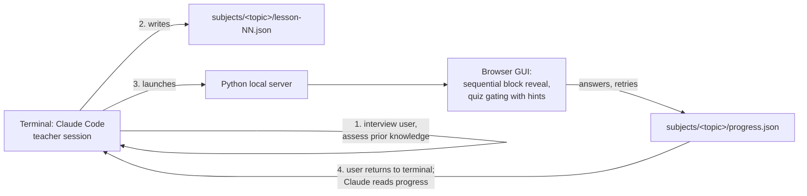

# Kalilmod

## What is Kalilmod

Kalilmod is an interactive teaching tool built around Claude Code. It solves a common problem in modern self-learning: LLMs and the internet provide such good explanations that a student can skim them, feel like they understand, and forget everything shortly after. Real learning happens only when the student must actively solve problems. Kalilmod forces interactive learning by alternating short explanations with frequent small quizzes — the student must engage with the material at every step instead of passively reading.

The creator of the repository is Michael Kali. "Kalilmod" sounds like the Hebrew קל ללמוד, meaning "easy to learn".

## Claude Code's two roles

Claude Code serves two roles in this repository:

1. **Builder** — writes the tool itself (server, GUI viewer, docs) and documents it so future sessions can use it.
2. **Teacher** — in future sessions, reads the content-creation instructions (`docs/teacher-guide.md`) and uses them to inject lesson content and orchestrate the learning process.

> **Current role: Builder.** The repository is in its building stage. When the tool exists and is documented, this marker flips to Teacher as the default role for new sessions.

## Architecture (v1)

### Feasibility background

The original idea — an HTML GUI backed by a background Claude session — is fully possible via the **Claude Agent SDK for Python** (`pip install claude-agent-sdk`): programmatic multi-turn sessions, streaming, resuming a session later (`resume=session_id`), and file tools scoped to a directory. It works on Windows. **However**, the Agent SDK requires an `ANTHROPIC_API_KEY` (Anthropic Console account, pay-per-token); it does not use the Claude Code subscription login. To avoid extra billing, **v1 uses the interactive Claude Code terminal session itself as the teacher** (subscription auth, zero marginal cost). The design keeps the lesson-file contract independent of who writes it, so the SDK can be swapped in later without redesign.

### v1 workflow



1. The user opens a Claude Code session in this repo and asks to start a new subject or continue an existing one (existing subjects are the folders under `subjects/`).
2. Claude (teacher role) interviews the user **in the terminal conversation** to assess prior knowledge — free-text and choice questions (e.g. "Do you know where the Roman empire was built?", "Which particles participate in Compton scattering?").
3. Based on the assessment, Claude writes `subjects/<topic>/lesson-NN.json` (typed content blocks, including per-question hints), then launches the local server, which opens the browser at the lesson page.
4. The GUI reveals blocks one at a time. Quizzes gate progress: a wrong answer shows the next pre-authored hint and allows a retry; the next block unlocks only after a correct answer or an explicit "show answer". The server persists all answers and retry counts to `subjects/<topic>/progress.json`.
5. When the lesson content runs out or the user wants more, they return to the terminal session. Claude reads `progress.json` (which questions were hard, how many retries) and generates the next lesson file. Content is generated incrementally, indefinitely — never a whole course up front.

### Upgrade path (later phase)

Swapping the terminal teacher for a background Agent SDK session (`claude-agent-sdk` + `ANTHROPIC_API_KEY`) enables:

- A true single-window experience — the GUI talks to the teacher directly, no terminal round-trips.
- **Live free-text/LaTeX answer evaluation inside the GUI**: the user's answer is sent to the SDK session, which evaluates it as LLMs do and returns feedback.
- Resuming a teaching session days later via the SDK's session-resume support.

Nothing in the lesson-file format or server needs to change for this upgrade; only the transport of "who generates content and evaluates free text" changes.

## Planned repository layout

```
serve.py                     # local server: serves the GUI, persists progress
gui/                         # static HTML/JS lesson viewer (one generic viewer for all subjects)
subjects/<topic>/            # one folder per subject
    lesson-01.json           # lesson files, numbered sequentially
    lesson-02.json
    progress.json            # answers, retries, current position — written by the server
docs/teacher-guide.md        # content-injection instructions for future teacher sessions
CLAUDE.md                    # this file
```

## Lesson content format

A lesson file is a JSON object with metadata and an ordered list of typed blocks. One generic viewer renders all block types.

```json
{
  "subject": "compton-scattering",
  "lesson": 1,
  "title": "Compton Scattering — Basics",
  "blocks": [
    {
      "type": "explanation",
      "markdown": "In **Compton scattering**, a photon scatters off a charged particle (usually an electron) and transfers part of its energy. The wavelength shift is $\\Delta\\lambda = \\frac{h}{m_e c}(1 - \\cos\\theta)$."
    },
    {
      "type": "link",
      "url": "https://en.wikipedia.org/wiki/Compton_scattering",
      "title": "Wikipedia: Compton scattering",
      "why": "Read the 'Description' section for the historical context of the 1923 experiment."
    },
    {
      "type": "video",
      "url": "https://www.youtube.com/watch?v=example",
      "title": "Compton scattering derivation",
      "focus": "Watch how conservation of energy and momentum are combined; you'll be quizzed on the assumptions."
    },
    {
      "type": "quiz-choice",
      "question": "Which particles participate in a Compton scattering process?",
      "options": [
        "A photon and an electron",
        "Two photons",
        "A proton and a neutron",
        "An electron and a positron"
      ],
      "answer": 0,
      "hints": [
        "One of the participants carries the electromagnetic wave.",
        "The other participant is the lightest charged particle in an atom."
      ]
    }
  ]
}
```

Block types:

| Type | Fields | Status |
|---|---|---|
| `explanation` | `markdown` (Markdown with LaTeX via `$...$` / `$$...$$`) | v1 |
| `link` | `url`, `title`, `why` (why/what to read) | v1 |
| `video` | `url`, `title`, `focus` (what to focus on) | v1 |
| `quiz-choice` | `question`, `options[]`, `answer` (correct index), `hints[]` (shown in order on wrong attempts) | v1 |
| `quiz-free` | reserved — free-text/LaTeX answer evaluated by Claude | deferred to Agent SDK phase |
| `manim` | reserved — manim-rendered animation | deferred |

**Anti-cheating is explicitly not a requirement.** The tool is for people who actually want to learn, so encoding correct answers client-side (in the JSON or HTML) is fine.

## Lesson flow rules

- **Sequential reveal**: blocks appear one at a time on a single lesson page (not a chat UI); the user advances explicitly.
- **Quiz gating**: a quiz block must be answered correctly before the next block unlocks. Wrong answer → next hint from `hints[]` → retry. After hints are exhausted (or on explicit request), a "show answer" option unlocks progress.
- **Frequent alternation** of explanation and quiz is the core pedagogical principle. As a rule of thumb, never more than 2–3 explanation/link/video blocks in a row without a quiz.
- **Guided reading**: before any "passive" content (text, equations, a graph, a linked article, a YouTube video), the lesson instructs the student to pick up on a specific delicate/important point in the upcoming material and tells them they will be asked about it — and the next quiz then asks exactly that. This keeps the student engaged even during the reading/watching parts. Concretely: put the "watch out for X" instruction in the block preceding the content (or in the `why`/`focus` field of a `link`/`video` block) and pair it with a matching `quiz-choice` right after. This is a **Teacher-role obligation** — the teacher must author lessons this way, and it must also be spelled out in `docs/teacher-guide.md` when that file is written (Phase 2), since the teacher will be a fresh Claude instance with no memory of this session.
- **Incremental generation**: the teacher generates one lesson file at a time and uses `progress.json` to adapt the next one. There is no requirement to author a whole course at once.

## Design decisions log

Decisions already made with the user — do not re-litigate them:

- **Python** for the server and tooling: manim is Python, and the Agent SDK has a Python package, so the whole stack stays in one language.
- **v1 teacher = the interactive terminal Claude Code session**, not the Agent SDK. Reason: the Agent SDK requires a pay-per-token `ANTHROPIC_API_KEY`, while the terminal session runs on the existing Claude Code subscription at zero extra cost. The SDK remains the documented upgrade path.
- **Free-text answers in the GUI are deferred.** v1 GUI quizzes are auto-evaluable only (multiple choice). The knowledge-assessment interview, which needs free text, happens in the terminal conversation before the GUI opens.
- **Structured JSON lesson files with typed blocks**, rendered by one generic viewer — rather than the teacher generating bespoke HTML per lesson. This keeps content generation cheap and the viewer testable.
- **Retry-with-hints gating** for wrong answers (see Lesson flow rules).
- **Single lesson page with sequential reveal**, not a chat interface.
- **Manim deferred** to a later phase; the block type is reserved so the schema won't churn.
- **GUI styling is out of scope for now** — make it work first.

## Current status & roadmap

- **Phase 0 — this document.** Done.
- **Phase 1 — minimal working tool**: `serve.py`, `gui/` viewer supporting the four v1 block types, and one hand-written sample subject under `subjects/` to prove the flow end to end.
- **Phase 2 — teacher enablement**: write `docs/teacher-guide.md` (how a teacher session interviews, authors lesson JSON, launches the server, reads progress), then run the first real Claude-taught subject.
- **Phase 3 — free-text evaluation**: integrate the Agent SDK (`claude-agent-sdk` + `ANTHROPIC_API_KEY`) to enable `quiz-free` blocks and in-GUI feedback.
- **Phase 4 — manim blocks**: render and embed manim animations as a block type.
