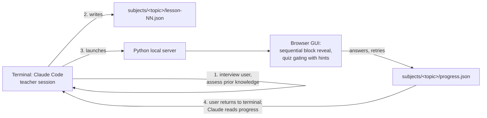

# Kalilmod

## What is Kalilmod

Kalilmod is an interactive teaching tool built around Claude Code. It solves a common problem in modern self-learning: LLMs and the internet provide such good explanations that a student can skim them, feel like they understand, and forget everything shortly after. Real learning happens only when the student must actively solve problems. Kalilmod forces interactive learning by alternating short explanations with frequent small quizzes — the student must engage with the material at every step instead of passively reading.

The creator of the repository is Michael Kali. "Kalilmod" sounds like the Hebrew קל ללמוד, meaning "easy to learn".

## Claude Code's two roles

Claude Code serves two roles in this repository:

1. **Builder** — writes the tool itself (server, GUI viewer, docs) and documents it so future sessions can use it.
2. **Teacher** — in future sessions, reads the content-creation instructions (`docs/teacher-guide.md`) and uses them to inject lesson content and orchestrate the learning process.

> **Current role: both.** The v1 tool works (server, viewer, sample subjects) and the teacher procedure is documented. If the user asks to **learn a subject**, act as Teacher: follow `docs/teacher-guide.md`. If the user asks to **develop the tool**, act as Builder.

## Architecture (v1)

### Feasibility background

The original idea — an HTML GUI backed by a background Claude session — is fully possible via the **Claude Agent SDK for Python** (`pip install claude-agent-sdk`): programmatic multi-turn sessions, streaming, resuming a session later (`resume=session_id`), and file tools scoped to a directory. It works on Windows. **However**, the Agent SDK requires an `ANTHROPIC_API_KEY` (Anthropic Console account, pay-per-token); it does not use the Claude Code subscription login. To avoid extra billing, **v1 uses the interactive Claude Code terminal session itself as the teacher** (subscription auth, zero marginal cost). The design keeps the lesson-file contract independent of who writes it, so the SDK can be swapped in later without redesign.

### v1 workflow



1. The user opens a Claude Code session in this repo and runs **`/teach-me <topic>`** (or `/open-existing-courses` to resume). These slash commands (in `.claude/commands/`) are thin wrappers around `docs/teacher-guide.md`.
2. Claude (teacher role) interviews the user **in the terminal conversation** to assess prior knowledge — free-text and choice questions.
3. Based on the assessment, Claude writes `subjects/<topic>/lesson-NN.json` (typed content blocks), then launches the local server in **dynamic** mode, which opens the browser at the lesson page.
4. The GUI reveals blocks one at a time. Multiple-choice quizzes gate with hints then "show answer". Free-text (`quiz-free`) answers and feedback are saved to `progress.json`; the user runs **`/review-answer`** in the terminal, Claude writes the evaluation/edit, and the GUI (which polls the read-only `reviews.json` and lesson file) updates **without a refresh**. The open lesson lives in the URL hash, so F5 restores position.
5. When content runs out or the user wants more, they run `/teach-me` again. Claude reads `progress.json` (which questions were hard, retries, free-text answers) and generates the next lesson. Content is generated incrementally, indefinitely.

**Session modes.** *Dynamic* (default; the slash commands launch it) means a live Claude session is present, enabling free-text review and live lesson edits. *Static* (`python serve.py --static`, for non-Claude LLMs or plain replay) disables those: free-text questions are self-checked against a hidden `reference`. The GUI reads the mode from `/api/mode`.

**File ownership (no write races).** `progress.json` is written only by the GUI (position, quiz state, free-text answers, feedback). `reviews.json` is written only by Claude (free-text verdicts, `feedbackHandled` counter) and served read-only. Lesson files are written by Claude, read by the GUI. Both `progress.json` and `reviews.json` are git-ignored per-user state; lessons are tracked.

### Upgrade path (later phase)

Free-text evaluation already works in v1 **without an API key** — the live Claude Code session evaluates via `/review-answer`. The remaining friction is that this is a manual terminal round-trip. Swapping the terminal teacher for a background Agent SDK session (`claude-agent-sdk` + `ANTHROPIC_API_KEY`) would remove it:

- A true single-window experience — the GUI talks to the teacher directly, no `/review-answer` step.
- Automatic free-text evaluation and lesson edits, pushed to the GUI without a terminal action.
- Resuming a teaching session days later via the SDK's session-resume support.

Nothing in the lesson-file format or server needs to change for this upgrade; only the transport of "who generates content and evaluates free text" changes (the file-ownership split already anticipates it).

## Planned repository layout

```
serve.py                     # local server: serves the GUI + JSON API; --static flag; /api/mode
gui/                         # static HTML/JS lesson viewer (one generic viewer for all subjects)
.claude/commands/            # slash-command skills: teach-me, open-existing-courses, review-answer
subjects/<topic>/            # one folder per subject
    lesson-01.json           # lesson files, numbered sequentially (tracked in git)
    lesson-02.json
    progress.json            # GUI-owned per-user state: position, answers, feedback (git-ignored)
    reviews.json             # Claude-owned: free-text verdicts, feedbackHandled (git-ignored)
docs/teacher-guide.md        # content-injection instructions for future teacher sessions
CLAUDE.md                    # this file
```

## Lesson content format

A lesson file is a JSON object with metadata and an ordered list of typed blocks. One generic viewer renders all block types.

```json
{
  "subject": "compton-scattering",
  "lesson": 1,
  "title": "Compton Scattering — Basics",
  "blocks": [
    {
      "type": "explanation",
      "markdown": "In **Compton scattering**, a photon scatters off a charged particle (usually an electron) and transfers part of its energy. The wavelength shift is $\\Delta\\lambda = \\frac{h}{m_e c}(1 - \\cos\\theta)$."
    },
    {
      "type": "link",
      "url": "https://en.wikipedia.org/wiki/Compton_scattering",
      "title": "Wikipedia: Compton scattering",
      "why": "Read the 'Description' section for the historical context of the 1923 experiment."
    },
    {
      "type": "video",
      "url": "https://www.youtube.com/watch?v=example",
      "title": "Compton scattering derivation",
      "focus": "Watch how conservation of energy and momentum are combined; you'll be quizzed on the assumptions."
    },
    {
      "type": "quiz-choice",
      "question": "Which particles participate in a Compton scattering process?",
      "options": [
        "A photon and an electron",
        "Two photons",
        "A proton and a neutron",
        "An electron and a positron"
      ],
      "answer": 0,
      "hints": [
        "One of the participants carries the electromagnetic wave.",
        "The other participant is the lightest charged particle in an atom."
      ]
    }
  ]
}
```

Block types:

| Type | Fields | Status |
|---|---|---|
| `explanation` | `markdown` (Markdown with LaTeX via `$...$` / `$$...$$`) | v1 |
| `link` | `url`, `title`, `why` (why/what to read) | v1 |
| `video` | `url`, `title`, `focus` (what to focus on). Some owners (esp. music labels) disable embedding — the GUI shows a "watch on YouTube" fallback link, but the teacher should prefer videos that allow embedded playback | v1 |
| `quiz-choice` | `question`, `options[]`, `answer` (correct index), `hints[]` (shown in order on wrong attempts) | v1 |
| `graph` | `data`, `layout` (Plotly.js spec, verbatim), optional `title`, `caption`. Rendered client-side by Plotly (CDN), theme-aware, interactive | v1 |
| `quiz-free` | `question` + hidden `reference`. Free-text/LaTeX answer. **Dynamic**: student submits, live Claude session evaluates via `/review-answer` (no API key needed). **Static**: student self-checks against `reference` | v1 |
| `manim` | reserved — manim-rendered **animation** (not static graphs — use `graph` for those). Optional: used only if manim is already installed on the machine; never a hard dependency | deferred |

**Anti-cheating is explicitly not a requirement.** The tool is for people who actually want to learn, so encoding correct answers client-side (in the JSON or HTML) is fine.

## Lesson flow rules

- **Sequential reveal**: blocks appear one at a time on a single lesson page (not a chat UI); the user advances explicitly.
- **Quiz gating**: a quiz block must be answered correctly before the next block unlocks. Wrong answer → next hint from `hints[]` → retry. After hints are exhausted (or on explicit request), a "show answer" option unlocks progress.
- **Frequent alternation** of explanation and quiz is the core pedagogical principle. As a rule of thumb, never more than 2–3 non-quiz blocks in a row without a quiz.
- **Step format (guided reading)**: each teaching step is `title → orienting lead → content → question(s)`. A short title names the idea; a 1–2 sentence *orienting lead* placed **before** the content tells the student what to pay attention to (a lens, not the answer, and not a paraphrase of the question); then the content; then one or more quizzes. Priming attention *before* reading — rather than a trailing "watch for X" cue that echoes the question — is what keeps the passive parts engaging. Title + lead + content normally live in one `explanation` block; for `link`/`video`/`graph` the lead goes in the `why`/`focus`/`caption` field. A content block may be followed by **several** `quiz-choice` blocks. This is a **Teacher-role obligation**, spelled out with examples in `docs/teacher-guide.md`.
- **Incremental generation**: the teacher generates one lesson file at a time and uses `progress.json` to adapt the next one. There is no requirement to author a whole course at once.

## Design decisions log

Decisions already made with the user — do not re-litigate them:

- **Python** for the server and tooling: manim is Python, and the Agent SDK has a Python package, so the whole stack stays in one language.
- **v1 teacher = the interactive terminal Claude Code session**, not the Agent SDK. Reason: the Agent SDK requires a pay-per-token `ANTHROPIC_API_KEY`, while the terminal session runs on the existing Claude Code subscription at zero extra cost. The SDK remains the documented upgrade path.
- **Free-text answers in the GUI are deferred.** v1 GUI quizzes are auto-evaluable only (multiple choice). The knowledge-assessment interview, which needs free text, happens in the terminal conversation before the GUI opens.
- **Structured JSON lesson files with typed blocks**, rendered by one generic viewer — rather than the teacher generating bespoke HTML per lesson. This keeps content generation cheap and the viewer testable.
- **Retry-with-hints gating** for wrong answers (see Lesson flow rules).
- **Single lesson page with sequential reveal**, not a chat interface.
- **Graphs use Plotly.js** (declarative JSON `data`/`layout`, rendered client-side from CDN). Chosen because the graph *is* JSON — it drops into the block schema with no build step — and because the teacher LLM, which authors blind (it never sees the rendered output), writes Plotly specs very reliably and they fail gracefully. Static custom figures could later use a pre-rendered matplotlib image; interactive exploration could later add a Desmos block. See the Plotly authoring rules in `docs/teacher-guide.md`.
- **Manim is animation-only and strictly optional.** It is an author-time tool, never a runtime dependency: the viewer only plays a pre-rendered video, which needs no packages. The teacher uses manim *only if it is already installed* (checked at author time) and falls back to a `graph` or explanation otherwise — so the base install stays Python-stdlib-only. The block type is reserved so the schema won't churn.
- **GUI styling**: a modern, elegant baseline is now in place (CSS-only, single file, no framework — automatic light/dark mode, card layout, styled quiz options, reveal animation). Keep future styling in the same lightweight, dependency-free spirit; no build step or frontend framework.
- **Interaction is skill-driven** (`/teach-me`, `/open-existing-courses`, `/review-answer`) rather than free-text prompts, so the student never has to phrase instructions. **Free-text review uses the live session, not an API key** — the deliberate choice that keeps v1 zero-cost. **Dynamic vs. static** exists so non-Claude LLMs can still generate and replay lessons (static self-checks free-text against a `reference`). **File ownership is split** (GUI writes `progress.json`; Claude writes `reviews.json` + lessons) specifically to avoid two writers racing, and the GUI **polls** the Claude-owned files so updates appear without a refresh; **F5 is safe** because the open lesson is in the URL hash.

## Current status & roadmap

- **Phase 0 — this document.** Done.
- **Phase 1 — minimal working tool.** Done: `serve.py`, `gui/index.html` viewer (four v1 block types, video embeds, progress status, restart), sample subjects `compton-scattering` and `_demo` (mechanism test).
- **Phase 2 — teacher enablement.** Done: `docs/teacher-guide.md` plus slash-command skills (`/teach-me`, `/open-existing-courses`, `/review-answer`).
- **Phase 3 — graphs.** Done: `graph` block via Plotly.js (interactive, theme-aware, client-side).
- **Phase 4 — free-text + sessions.** Done: `quiz-free` blocks evaluated live by the Claude session via `/review-answer` (no API key); dynamic/static modes; GUI live-polling (reviews and lesson edits appear without refresh); F5 restores position.
- **Phase 5 — manim animations** (optional capability): render and embed manim animations as a block type, used only when manim is detected on the machine.
- **Later — Agent SDK** (`claude-agent-sdk` + `ANTHROPIC_API_KEY`): remove the manual `/review-answer` round-trip (see Upgrade path).
